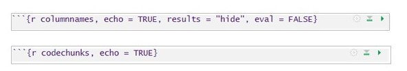
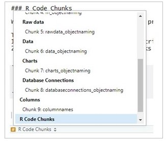
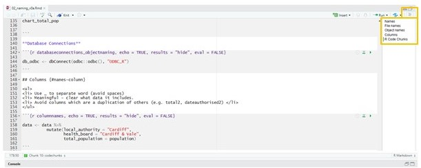

```{r namingsetup, include=FALSE}
knitr::opts_chunk$set(echo = TRUE)
```

<!-- Note: File must start with h1 (#) as this forms a new chapter. -->

# Names {#names}

Meaningful and consistent names for files, objects, columns and chunks of code make it easier for the user to understand and navigate around the script. This section includes guidance and examples on naming.  

## File names {#names-file}

Key points: 

**Do**

<ul> 
<li> Meaningful file names
<li> Use letters, numbers, - and _ 
<li> Lowercase (easier to remember)
<li> Files which include a single function should be called the same as the function
<li> If a file contains multiple functions, try to give it a concise but meaningful name 
<li> If files should be run in a particular order then number them BUT be sure to keep this numbering up to date. </li>

</ul> 

**Avoid**

<ul> 
<li> Avoid using special characters 
<li> Spaces between words </li>
</ul> 

```{r namingexamples, echo = TRUE, results = "hide"}

# File names: Good

"data_manipulation.R"
"chart_functions.R"


"01_functions.R"
"02_datacleaning.R"
"03_charts.R"


# File names: Avoid (spaces between words, upper and lower case, symbols)
"Data Manipulation.R"
"chart functions & testing.R"


```


## Object names {#names-object}

Similar to files names, object names should ideally only use:

<ul> 
<li> lowercase <br>
<li> numbers <br>
<li> underscores (_) to separate words </li> 
</ul> 

```{r objectnamesexample, echo = TRUE, results = "hide", eval = FALSE}

# Object names: Good
chart_highest_three
chart_highest_3

# Object names: Avoid (mix of upper and lowercase, lack of underscore to separate words)
highestThree
charthighestthree

```

Try to make the object names meaningful (i.e. relating to what they include) and following a similar structure, for example:

<ul>
<li> functions: fn_name 
<li> raw data: data_raw_name
<li> data: data_name 
<li> charts: chart_name 
<li> database connections: db_name </li> 

</ul>

**Functions**

```{r fn_objectnaming, echo = TRUE, results = "hide", eval = FALSE}

fn_crude_rate
fn_clean_data


```

**Raw data**

```{r rawdata_objectnaming, echo = TRUE, results = "hide", eval = FALSE}

data_raw_MYE
data_raw_deaths

```

**Data**

```{r data_objectnaming, echo = TRUE, results = "hide", eval = FALSE}

data_deaths_by_year
data_total_admissions

```

**Charts**

```{r charts_objectnaming, echo = TRUE, results = "hide", eval = FALSE}
chart_health_board
chart_total_pop


```

**Database Connections**

```{r databaseconnections_objectnaming, echo = TRUE, results = "hide", eval = FALSE}

db_odbc <- dbConnect(odbc::odbc(), "ODBC_R")

```

## Columns {#names-column}

<ul>
<li> Use _ to separate word (avoid spaces) 
<li> Meaningful - clear what data it includes.
<li> Avoid columns which are a duplication of others (e.g. total2, dateauthorised2) </li> 
</ul>

```{r columnnames, echo = TRUE, results = "hide", eval = FALSE}

data <- data %>% 
          mutate(local_authority = "Cardiff",
                 health_board = "Cardiff & Vale",
                 total_population = population)

```


## R Code Chunks {#names-r-code-chunks}

When creating rmd scripts, it can be useful to label your chunks of code.

This has two main benefits: <br>
1. Helps you to navigate around your R script (acts like a contents) <br>
2. Easily identify specific code chunks which might have caused the script to fall over.

*Example code chunk names*

```{r codechunks, echo=FALSE, out.width=600}



```

There are two ways of using the code chunk names for navigation:

*1. Navigation at the bottom of the script*

```{r codechunksnav, echo=FALSE, out.width=300}



```


*2. Navigation to the right hand side of the script*

```{r codechunkslist, echo=FALSE, out.width=600}



```

The above navigation options can also be used with named section breaks. See [Internal Structure](#styling-internal-structure) section in this guide for alternative ways to denote sections.

